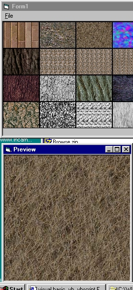



## Picture Browser

### Description

Puts up a thumbnail size picture of all the pictures in a directory. Single clicking on a thumbnail takes you to a full size preview of that picture.
 
### More Info
 

             |
---                |---
**Submitted On**   |2000-11-24 16:58:40
**By**             |[Kamilche](https://github.com/Planet-Source-Code/PSCIndex/blob/master/ByAuthor/kamilche.md)
**Level**          |Beginner
**User Rating**    |4.6 (23 globes from 5 users)
**Compatibility**  |VB 4\.0 \(32\-bit\), VB 5\.0, VB 6\.0, VB Script
**Category**       |[Graphics](https://github.com/Planet-Source-Code/PSCIndex/blob/master/ByCategory/graphics__1-46.md)
**World**          |[Visual Basic](https://github.com/Planet-Source-Code/PSCIndex/blob/master/ByWorld/visual-basic.md)
**Archive File**   |[CODE\_UPLOAD1203111242000\.zip](https://github.com/Planet-Source-Code/kamilche-picture-browser__1-13090/archive/master.zip)

